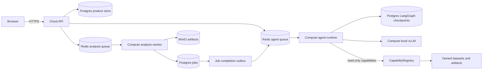

# OmicsPrism Architecture

This document describes the v3 deployment that is currently implemented and
tested. It is intentionally narrower than a future multi-tenant production
design.

## Runtime Topology

The cloud API is the authenticated product boundary. It persists a thread,
turn, and user message, then publishes an at-least-once Agent work item. The
compute `agent-runtime` is the only process that invokes the LangGraph graph
and vLLM. Both API and runtime use the same Postgres database, while the graph
checkpoint is owned by LangGraph's Postgres checkpointer rather than a second
application state machine.

The analysis worker remains a separate Redis consumer. Confirmed analysis
plans create an idempotent Job; the worker writes status and artifacts, and the
completion outbox publishes a continuation turn for the runtime. This keeps
long-running analysis outside the Agent turn deadline.

## Agent Execution Boundary

The graph has a bounded model/tool loop. The model emits one typed decision;
Pydantic validation rejects invalid JSON or invalid action semantics. Read-only
tool calls pass through `CapabilityRegistry`, which applies strict request and
response schemas and ownership checks before calling `AgentToolRuntime`.
`prepare_analysis` and `submit_analysis` are graph capabilities, not MCP
capabilities. MCP currently exposes only the six read-only registry entries
through an in-process adapter; no MCP network listener is enabled.

## Durability And Delivery

- Product rows and trace events are persisted in Postgres.
- Graph state is persisted by LangGraph's Postgres checkpointer.
- Redis delivery is at-least-once; processing entries are recoverable after a
  runtime restart.
- Job creation is effectively-once through a user-scoped idempotency key.
- Job completion reconciliation is idempotent and does not create duplicate
  continuation turns.

## Explicit Non-Goals

The current deployment does not claim complete remote MCP authentication,
multi-replica Agent scheduling, arbitrary code execution, unrestricted file or
SQL access, or production-grade cost accounting for local vLLM usage.
