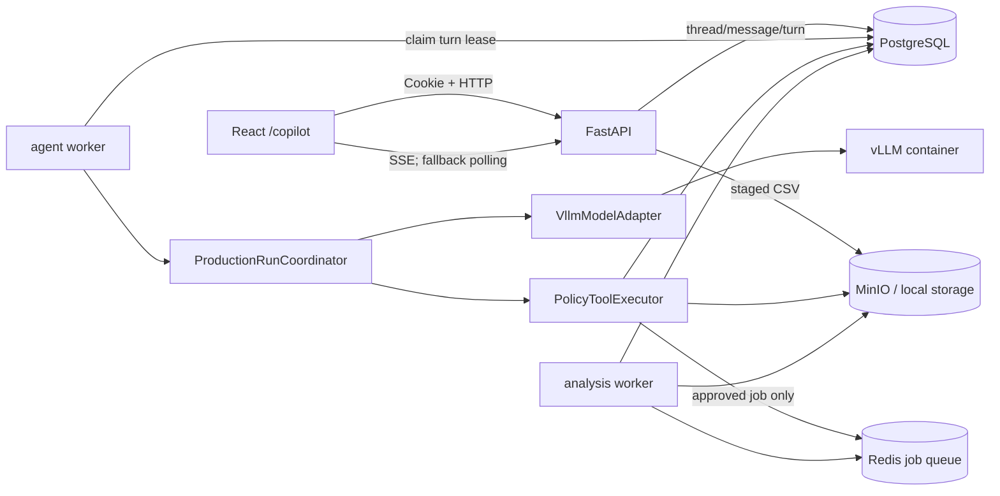

# Phase 6 — Copilot 产品接入：生产运行时、对话 API 与前端闭环

> 状态：已完成。Gate A-E 均已通过自动化验证、真实服务器演示与人工审阅；后续进入维护与回归，完成证据见 `PHASE_6_REPORT.md`。
> 基线：Phase 0–5 已完成；本 Phase 不改写既有评测成绩，不读取或依赖 `OMICS_PRISM_COPILOT_PRODUCTIZATION_SPEC.md`。
> 目标：用户在 OmicsPrism 前端完成对话、上传输入、审批分析、查看任务和解读结果的完整闭环。

---

## 1. 完成后的用户体验

Phase 6 完成后，用户可以在 `/copilot` 中：

1. 新建和恢复自己的对话线程。
2. 上传 DEG、DEM、GMA 所需 CSV，或从自己已有的 job/result 进入 Copilot。
3. 用自然语言说明目标，由 Copilot 推荐可行分析、展示参数和有效 contrast。
4. 在结构化审批面板中检查 plan，并显式批准或拒绝。
5. 批准后只创建一次真实 job，在对话中查看进度并跳转到现有任务页或结果页。
6. 对已完成结果提问，看到带 artifact、checksum 和 row id 的可核验证据引用。
7. vLLM 不可用时看到明确的可重试错误；原手工表单、任务和结果页面继续正常工作。

Phase 6 的“完成”不是只有一个聊天框，而是浏览器、HTTP 契约、生产协调器、持久化、独立 agent worker、现有 job/文件系统和 vLLM 的端到端闭环。

---

## 2. 当前基线与真实缺口

### 已经具备

- R1–R6 安全边界、`AgentDecision` schema、router、profile 白名单、审批门、工具、grounding/verifier 和 25-case eval。
- `agent_runs`、append-only `agent_events` 表及普通 `omics_app` 角色。
- `VllmModelAdapter`、`PolicyToolExecutor`、真实 job repository、文件存储和分析 worker。
- React 18 + TypeScript + Vite 前端、Cookie 会话、job API、任务进度 SSE 和结果页面。

### 仍然缺少

- 当前 `FixtureRunCoordinator` 明确是测试 harness，不能作为生产协调器。
- FastAPI 没有 thread/message/turn/approval/input-bundle 的 agent HTTP API。
- `StateStore`、`PlanStore`、`ApprovalGate` 和 `AgentEventStore` 缺少 PostgreSQL 生产实现。
- 没有消息历史、turn 幂等队列、worker lease/recovery 和用户可见的结构化消息 DTO。
- 新上传文件只能直接创建 job；缺少“审批前暂存但不创建 job”的输入来源。
- 前端没有 `/copilot` 路由、对话历史、附件、plan 审批、引用和 job 状态组件。

---

## 3. 本 Phase 范围

### 必须做

- 实现 `ProductionRunCoordinator`，把已有 router/model/policy/tools/approval/grounding/verifier 组装成有界的生产控制循环。
- 新增 PostgreSQL thread、message、turn、plan、approval 和 input bundle 持久化。
- 新增同代码库内的独立 `backend.agent_worker` 进程；API 请求不直接等待 vLLM。
- 新增 `/api/agent/*` HTTP/SSE 契约，身份只取当前 HttpOnly Cookie 会话。
- 新增受控 CSV 暂存输入，审批前不得创建业务 job。
- 新增 `/copilot` 和 `/copilot/:threadId` 前端，并与现有 job/progress/results 页面互通。
- 补齐 API、数据库权限、worker recovery、前端和端到端测试。
- 更新 OpenAPI 类型、README、部署文档和 `PHASE_6_REPORT.md`。

### 明确不做

- 不做 OIDC/RBAC、组织空间、管理员后台或原始 trace 管理 UI；当前仍使用现有匿名 Cookie session 作为 `user_id`。
- 不做通用 RAG、SQL、shell、任意 Python、联网文献搜索或新业务工具。
- 不做 token 级流式生成；Phase 6 只流式通知 turn/message 状态。
- 不让浏览器直连 vLLM，不向模型发送 Cookie、DSN、对象存储 key、文件路径或原始 CSV。
- 不把 agent worker 做成新的独立产品/API 服务，也不引入 LangChain/LangGraph。
- 不删除或重写现有手工分析页面；Copilot 是并行入口。

---

## 4. Phase 6 不可破坏的约束

R1–R6 全部继续生效，并增加以下产品接入约束：

1. **身份只能来自服务端会话**：所有 agent 请求 schema `extra=forbid`，不得出现 `user_id`；thread、run、message、turn、bundle、plan、approval、job 查询都绑定 `resource_id + session_id`，越权统一 404。
2. **审批只认结构化端点**：自然语言中的“批准”“approve”不得直接创建 job。只有审批 API 对 `approval_id + plan_hash + session_id + TTL` 全部校验成功，才允许执行写工具。
3. **审批前零 job**：附件上传、推荐、preflight、plan 展示和拒绝审批均不得在 `jobs` 表新增记录。
4. **消息不是模型 UI 指令**：模型仍只返回 `AgentDecision` 或受约束的 grounded draft；HTML、链接、按钮、审批状态和 job deep link 全部由后端根据白名单 DTO 生成。
5. **一线程一活动 turn**：同一 thread 同时最多一个 queued/running turn；重复请求通过幂等键返回原 turn，不重复调模型、工具或建 job。
6. **模型故障隔离**：vLLM endpoint 只配置给 agent worker。agent worker 停止或模型超时不能拖垮 API、分析 worker或现有 `/api/jobs/*`。
7. **用户端不暴露 raw trace**：前端 SSE 只推送用户可见事件；append-only `agent_events` 仍用于审计和测试，不新增无管理员身份的 trace UI。

所有触及以上约束的测试必须先写，并由人工审阅。

---

## 5. 目标架构



API 不持有模型客户端；agent worker 与现有 analysis worker 是两个进程、两个职责。停止 vLLM 或 agent worker 时，API 和 analysis worker 仍可服务原业务。

---

## 6. 数据库与权限契约

继续使用纯 SQL migration，不引入 Alembic：

- `migrations/004_agent_product_tables.sql`
- `migrations/005_agent_product_roles.sql`

### 6.1 新表

| 表 | 关键字段 | 用途与约束 |
| --- | --- | --- |
| `agent_threads` | `thread_id, user_id, title, current_run_id, status, version, created_at, updated_at` | 对话目录；不物理删除，只允许归档 |
| `agent_messages` | `message_id, thread_id, run_id, user_id, role, blocks, created_at` | 用户可见历史；append-only，`blocks` 由 Pydantic 校验 |
| `agent_turns` | `turn_id, thread_id, run_id, user_id, idempotency_key, request_hash, status, attempt, lease_owner, lease_expires_at, error_code, timestamps` | 异步 turn 队列、幂等、lease 和 crash recovery |
| `agent_plans` | `plan_id, run_id, thread_id, user_id, plan_hash, payload, submitted_job_ids, version, timestamps` | `PlanRecord` 的生产持久化 |
| `agent_approvals` | `approval_id, plan_id, run_id, thread_id, user_id, plan_hash, status, expires_at, timestamps` | pending/approved/rejected/expired；plan hash 强绑定 |
| `agent_input_bundles` | `bundle_id, thread_id, user_id, status, expires_at, created_at` | 审批前输入暂存；不是 job |
| `agent_input_files` | `file_id, bundle_id, user_id, field, filename, storage_key, checksum, content_type, size_bytes, created_at` | 暂存文件元数据；`storage_key` 永不进入模型或前端响应 |

沿用既有 `agent_runs` 和 `agent_events`，不新造第二套 run/event 表。`agent_runs` 用乐观锁更新；`agent_events` 保持 append-only。

### 6.2 数据库硬约束

- `agent_messages`、`agent_events`：`omics_app` 只有 `SELECT, INSERT`，显式无 `UPDATE, DELETE, TRUNCATE`。
- `agent_threads`、`agent_runs`、`agent_turns`、`agent_plans`、`agent_approvals`、`agent_input_bundles`：只授予业务所需的 `SELECT, INSERT, UPDATE`，不授予 `DELETE`。
- `agent_input_files`：`SELECT, INSERT`；清理由受控 housekeeping 以管理员/专用维护身份执行，不给 API/worker 任意删除权限。
- 唯一约束：`(user_id, idempotency_key)`；同一个 key 携带不同 `request_hash` 返回 409。
- 部分唯一索引：每个 thread 最多一个 `queued/running` turn。
- 所有跨用户 repository 查询使用 `resource_id + user_id`；找不到与不属于当前用户返回同一个 404。

真实 PostgreSQL 权限测试在本地无 DB 时继续 `skipif`，服务器必须实际执行并把输出写进 Phase 报告。

---

## 7. 所有新增数据契约集中到 `schemas.py`

不得在路由、worker 或前端手写第二套后端 schema。新增的核心契约包括：

- `AgentThreadCreateRequest` / `AgentThreadResponse` / `AgentThreadListResponse`
- `AgentTurnCreateRequest` / `AgentTurnResponse` / `AgentTurnStatus`
- `AgentApprovalRequest`，仅允许 `decision: approve | reject` 与当前 `plan_hash`
- `AgentMessageResponse` 与 discriminated-union `AgentMessageBlock`
- `AgentInputBundleResponse` / `AgentInputFileResponse`
- `AgentStreamEvent`

同时演进两个既有内部契约：

- 新增 `AgentInputSourceRef(kind: existing_job | staged_bundle, source_id)`，`PlanRecord` 使用该字段替代只适用于既有 job 的 `source_job_id`。计划 hash 必须包含完整 input source ref；Phase 3–5 fixture 和回归测试同步迁移，不能用 bundle id 冒充 job id。
- `AgentDecision` 新增有界的 `grounded_answer: GroundedAnswer | None`。它只允许在 `action=answer` 且本轮已有 `query_result_evidence` 时出现；claim 数量、文本长度和 row id 数量必须设上限。这样 LLM 仍然只输出一个经过 schema 校验的 `AgentDecision`，不会绕开 R1。

`ModelContext` 只增加两类有界信息：

- `conversation_summary`：由服务端根据当前状态和最近最多 6 条用户可见消息确定性构建，总长不超过既有 4000 字符；不再调用另一个模型做摘要。
- `evidence`：仅在 interpretation 回答步骤注入本轮 `query_result_evidence` 的裁剪结果，沿用最多 50 行且 32 KB 限制；不包含文件路径、storage key 或未返回行。

状态机确定每一步允许调用的工具，`AgentDecision` 不新增任意工具名或任意 URL 字段。即使模型给出错误 action，也必须先经过 `DecisionValidator`、profile 白名单与 `PolicyGuard`，再由协调器映射到固定工具。

### 7.1 用户可见消息块

前端只渲染以下服务端白名单块，不渲染模型 HTML：

| `type` | 用途 | 关键内容 |
| --- | --- | --- |
| `text` | 普通回复或追问 | 纯文本，前端转义 |
| `input_summary` | 已接收输入 | bundle id、字段角色、原文件名、大小、checksum；无路径/key |
| `recommendation` | 分析推荐 | 唯一真值 `differential/dem/correlation` 与展示标签 |
| `plan` | 审批前计划 | plan id/hash、参数、contrast、warning、有效期 |
| `approval` | 审批状态 | approval id、plan hash、pending/approved/rejected/expired |
| `job` | 已提交任务 | job id、状态、进度、现有 progress/results deep link |
| `evidence` | grounded 回答 | claims 与 artifact/checksum/row ids |
| `error` | 可恢复错误 | code、user message、retryable、request id |

`blocks` 的链接只允许后端生成站内路径；模型输出中出现 URL 时按普通文本处理。

---

## 8. HTTP 与 SSE 契约

所有路径都使用当前 `omicsprism_session` HttpOnly Cookie；请求体不接受 `user_id`。

| 方法 | 路径 | 行为 |
| --- | --- | --- |
| `POST` | `/api/agent/threads` | 创建 thread 与初始 run；可选绑定已通过 ownership 检查的 `focus_job_ids` |
| `GET` | `/api/agent/threads` | 列出当前 session 的 thread，游标分页 |
| `GET` | `/api/agent/threads/{thread_id}` | 返回 thread/run 快照；越权 404 |
| `GET` | `/api/agent/threads/{thread_id}/messages` | 返回用户可见消息，游标分页 |
| `POST` | `/api/agent/threads/{thread_id}/input-bundles` | multipart 上传受控 CSV，返回 201；不创建 job |
| `POST` | `/api/agent/threads/{thread_id}/turns` | 持久化用户消息并入队，返回 202；必须带 `Idempotency-Key` |
| `GET` | `/api/agent/threads/{thread_id}/turns/{turn_id}` | 获取 turn 状态，作为 SSE 失败后的轮询路径 |
| `GET` | `/api/agent/threads/{thread_id}/stream` | SSE：`turn.updated/message.created`；仅用户可见投影 |
| `POST` | `/api/agent/threads/{thread_id}/approvals/{approval_id}` | 显式批准或拒绝，校验 plan hash/TTL/owner；批准返回 202 turn |

### 8.1 turn 请求

```json
{
  "message": "请根据这些输入推荐分析，并比较 salt 与 control",
  "input_bundle_id": "bundle-uuid-or-null",
  "focus_job_ids": []
}
```

约束：message 1–4000 字符、focus job 最多 20 个；所有 focus job 在创建 turn 前逐个校验 ownership。API 在同一事务中插入 user message 与 queued turn，随后立即返回，不等待模型。

### 8.2 审批请求

```json
{
  "decision": "approve",
  "plan_hash": "sha256:..."
}
```

批准动作必须同时满足 session owner、thread、run、approval、plan、未过期和 hash 一致。拒绝只更新 approval/run 状态并追加消息，job 创建数保持 0。过期返回 409 并要求重新生成 plan。

### 8.3 状态码

- 创建 thread/input：201。
- turn/批准入队：202。
- schema/文件错误：400/413。
- 越权或不存在：统一 404。
- 过期审批、乐观锁冲突、同 key 不同请求：409。
- agent 能力未配置：503，但仅限 agent 创建/turn 路径；`/health` 与 `/api/jobs/*` 继续可用。

---

## 9. 输入暂存与现有 job 接入

### 9.1 新上传输入

- 只允许 `.csv`，字段角色只允许 `counts/metadata/metabs/transcriptome/metabolome/group`。
- 每文件最大 50 MB，每 bundle 最大 6 个文件且总计最大 150 MB；空文件拒绝。
- 上传时计算 checksum，文件写入隔离的 `agent-inputs/{bundle_id}/` 存储前缀，元数据绑定 thread + session。
- 模型只看到 `available_input_roles` 和裁剪后的结构摘要，永远看不到 CSV 内容、路径或 storage key。
- 未使用 bundle 24 小时过期；已提交后由 housekeeping 清理暂存副本，真实 job 保留自己的输入副本。

### 9.2 不创建“假 source job”

新增 `AgentInputSource` 协议：

- `ExistingJobInputSource`：从当前用户已有 job 读取/复制输入。
- `StagedBundleInputSource`：从当前用户的 input bundle 读取/复制输入。

`AgentToolRuntime` 在生产中接收 ownership-bound `AgentInputSource`，不接收任意路径。新增统一的 `from_input_source(...)` 装配；既有 `from_source_job(...)` 可作为兼容入口委托给 `ExistingJobInputSource`。`submit_approved_plan` 在审批通过后直接把暂存输入复制到真实 job，再以既有幂等规则保存和 enqueue。审批前 `jobs` 表必须为零增量。

### 9.3 从结果页进入 Copilot

现有 results 页面新增 “Ask Copilot” 命令，服务端创建带 `focus_job_ids=[job_id]` 的 thread。ownership 必须在服务端再次校验；前端路由参数不是授权。

---

## 10. 生产协调器与 agent worker

### 10.1 `ProductionRunCoordinator`

写在 `backend/app/agent/runtime.py`，不把 `FixtureRunCoordinator` 改名冒充生产实现。每个用户 turn 内允许一个有界循环：

- 最多 8 个状态迁移。
- 最多 3 次模型调用。
- 最多 6 次工具调用。
- 总预算默认 90 秒；单工具继续使用现有超时和 50 行/32 KB 裁剪。
- 遇到 `NEED_USER_INPUT`、pending approval、用户可见 answer、job submitted 或错误即终止当前 turn。

协调器只编排：router → context → model decision → validator → policy → tool → grounding/verifier → message projection。模型和工具均通过现有接口调用，协调器不直接读 DB/文件。状态机负责把 action 映射为固定工具，模型不能选择任意工具。

解读结果时，第一次模型决策用于形成安全查询参数；工具返回裁剪 evidence 后，第二次模型决策只能填写 `AgentDecision.grounded_answer`。用户可见 `evidence` block 必须经过 `GroundedAnswerPipeline`；0 行直接使用固定模板，不再调用模型，也不能回退为普通模型文本。验证失败只允许既有的一次修复流程，仍失败则展示原始证据行降级模板。

### 10.2 worker lease 与恢复

新增 `python -m backend.agent_worker`：

1. 使用 `FOR UPDATE SKIP LOCKED` claim 一个 queued turn。
2. 写入 `lease_owner/lease_expires_at` 后释放数据库锁，再调用模型和工具。
3. 以 run version 乐观锁提交新状态、assistant message 和事件。
4. worker 崩溃后，过期 lease 可被重新 claim；副作用依赖 turn/idempotency key 去重。
5. 达到最大 attempt 后写结构化 error block，不无限重试。

同一 thread 的 partial unique index和 store 检查共同阻止并发 turn。running turn 被重复提交时返回原 turn，而不是并行执行。

### 10.3 模型故障

- `ModelUnavailableError`、连接失败、超时和无效 schema 分别映射稳定 error code。
- 模型失败不得执行写工具；run 保留可重试 checkpoint。
- agent worker 的模型 URL/API key 不提供给 API、analysis worker 或浏览器。
- 不在 agent turn 中持续轮询长任务；job card 复用现有 job progress SSE，用户后续询问状态时才调用 `get_jobs_status`。

agent SSE 使用基于 message/turn cursor 的数据库增量读取，默认 1 秒检查一次并每 15 秒发送 keepalive；多 Uvicorn worker 下不依赖进程内队列。SSE 只负责对话事件，`JobBlock` 继续调用现有 `/api/jobs/{job_id}/progress/events`，失败时沿用现有轮询回退。

---

## 11. 前端范围

新增 `frontend/src/copilot/`，避免继续把所有逻辑堆进 `App.tsx`。至少拆分：

- `CopilotPage.tsx`：页面与路由状态。
- `ThreadList.tsx`：线程列表、创建与移动端抽屉。
- `MessageList.tsx` / `MessageBlock.tsx`：typed block 渲染。
- `Composer.tsx`：文本、CSV 附件、发送状态。
- `PlanApproval.tsx`：参数、contrast、warning、TTL、批准/拒绝。
- `JobBlock.tsx`：复用 progress subscription 与现有页面 deep link。
- `EvidenceBlock.tsx`：claims 与可展开引用。
- `useAgentStream.ts`：SSE，断线后指数退避并回退 polling。
- `agent-api.ts` / 生成的 `api-types.ts`：唯一 HTTP 契约。

### 11.1 页面与交互

- 顶部导航增加带图标的 “Copilot”；路由为 `/copilot` 和 `/copilot/:threadId`。
- 桌面使用线程侧栏 + 主对话区；移动端侧栏改抽屉，composer 固定在可视区底部且不遮挡消息。
- 消息区不使用卡片套卡片；plan、approval、job 和 evidence 是独立语义块。
- 图标按钮使用 `lucide-react` 并带 tooltip/accessible label；不手绘新 SVG 图标。
- approval 必须是明确的 Approve / Reject 命令，不用普通聊天文本代替。批准按钮防重复点击，并显示当前 plan hash 的短摘要和过期时间。
- 上传区显示角色、文件名、大小和校验状态；错误必须定位到具体文件/字段。
- 模型不可用时展示“Copilot 暂时不可用”，保留草稿和 Retry；同时提供返回 New Analysis / My Jobs 的正常导航。
- 不渲染模型提供的 HTML；普通文本按纯文本换行，引用和链接只来自 typed block。

### 11.2 前端依赖

允许新增：

- `lucide-react`：与控件语义一致的图标。
- `vitest`、`@testing-library/react`、`@testing-library/user-event`、`jsdom`：组件和交互测试。
- `@playwright/test`：关键浏览器闭环与响应式验收。

不引入新的状态管理框架；React hooks 足够支撑当前范围。

---

## 12. 实施顺序与质量门

### Gate A — 红线测试与数据库契约

先写失败测试，再写 `004/005` SQL 和 PostgreSQL repositories：

- thread/run/message/turn/bundle/plan/approval 跨用户全部 404。
- request body 出现 `user_id` 被 schema 拒绝。
- messages/events 对 `omics_app` 无 UPDATE/DELETE；其他表无 DELETE。
- 未审批、过期、hash 不匹配、已拒绝、错误 session 均创建 0 job。
- 同一 idempotency key 重放只产生一个 turn、一次模型调用和至多一个 job。

Gate A 必须人工审阅后才能进入生产协调器。

### Gate B — 生产协调器与 worker

- 实现 PostgreSQL stores、`AgentInputSource`、`ProductionRunCoordinator` 和 `agent_worker`。
- 用 stub + real repositories 跑 analyze → preflight → approval → submit → job card。
- 用 fixture evidence 跑 interpret → grounded answer → citation block。
- 验证 lease recovery、乐观锁冲突和模型故障不产生副作用。

Gate B 必须重新跑 Phase 5 的 25-case unit/offline harness，安全指标不得回归。

### Gate C — HTTP/SSE 契约

- 新增 agent router，保持 `main.py` 只负责 HTTP 适配；装配放在 `backend/app/agent/bootstrap.py`。
- API 只入队，不在 Uvicorn worker 内调 vLLM。
- SSE 只发送用户可见投影，断线可用 turn/messages endpoint 恢复。
- OpenAPI 生成的 TypeScript 类型与后端 schema 一致。

### Gate D — 前端体验

- 实现 `/copilot`、线程、消息、附件、审批、job 和 evidence。
- 实现 loading/empty/retry/expired/offline/404 状态。
- 完成组件测试、键盘操作、移动端和桌面截图验收。

### Gate E — 服务器闭环

- 真实 PostgreSQL + Redis + MinIO + vLLM + agent worker 部署。
- 新上传 DEG CSV，经 plan 审批后创建并完成 job。
- 从现有 GMA 结果进入 Copilot，返回有引用的 grounded 回答。
- 用户 B 请求用户 A 的 thread/job/bundle/approval 全部 404。
- 停止 vLLM/agent worker 后，手工分析、任务进度和结果下载继续正常。

---

## 13. 测试矩阵

### 后端自动化

- schema：所有新增 request/response/block，extra fields 拒绝。
- repository：ownership、pagination、optimistic lock、append-only、turn lease、idempotency。
- runtime：两个 profile 白名单、审批、有效 contrast、一次写、grounding/verifier、预算上限。
- API：Cookie 身份、201/202/404/409/413/503、SSE 恢复、模型故障隔离。
- permissions：真实 PostgreSQL 角色测试。
- regression：`python -m pytest backend/tests -q -rs` 与 25-case unit eval。

### 前端自动化

- typed message block 渲染，不接受任意 HTML。
- 上传角色、文件限制和错误展示。
- plan 批准/拒绝、过期、双击防重。
- SSE message 更新与 polling fallback。
- job progress/results deep link。
- 跨用户/不存在 404 不泄露资源信息。
- Playwright：桌面与移动端 analyze/approve/job、interpret/citation、model-off 三条流程。

### 人工红线审阅

- R1：模型请求抓包中无句柄、凭据、原始 CSV、路径/storage key。
- R2：interpretation profile 结构上无写工具。
- R3：所有身份由 Cookie 内注入，跨用户均 404。
- R4：批准前 job 增量为 0；有效批准后恰好为 1。
- R5：数字与引用能追到 evidence rows，空结果使用固定模板。
- R6：关闭 vLLM/agent worker 后原业务可用。

---

## 14. 部署与运维

新增独立的 `agent-worker` 部署单元，但 vLLM 保持独立容器。agent worker 必须部署在能访问 runtime PostgreSQL、Redis、MinIO 和 vLLM 的受控主机上；当前双服务器环境优先与 vLLM 同机，并在受版本控制的 worker compose/部署文件中声明，不依赖服务器上的未跟踪 compose 文件。

- `api`：runtime DSN、存储配置；不配置模型 URL/key。
- `agent-worker`：runtime DSN、Redis job queue、MinIO、模型 URL/name/key；当前环境部署在 worker 服务器。
- `worker`：原分析执行配置；不配置模型 URL/key。
- `vLLM`：继续使用独立端口/容器，故障不参与 API 健康判断。

新增环境变量至少包括：

```text
OMICS_PRISM_AGENT_ENABLED=true
OMICS_PRISM_AGENT_MODEL_URL=http://<vllm-host>:8000
OMICS_PRISM_AGENT_MODEL_NAME=Qwen3-14B-AWQ
OMICS_PRISM_AGENT_MODEL_API_KEY=
OMICS_PRISM_AGENT_TURN_TIMEOUT_SECONDS=90
OMICS_PRISM_AGENT_MAX_ATTEMPTS=2
OMICS_PRISM_AGENT_INPUT_TTL_HOURS=24
```

`OMICS_PRISM_AGENT_ENABLED=false` 时 `/api/agent/*` 返回明确 503，原 `/health` 和 `/api/jobs/*` 不受影响。

部署顺序：migration → API → analysis worker → agent worker → frontend。回滚时可先停 agent worker 并关闭 feature flag，不回滚或删除已经持久化的审计记录。

---

## 15. DoD

- [x] `ProductionRunCoordinator` 使用真实 model/tool/store 装配，`FixtureRunCoordinator` 仍只用于测试。
- [x] `004/005` 纯 SQL migration、PostgreSQL stores 和 `omics_app` 最小权限完成；真实服务器权限测试通过。
- [x] thread/message/turn/approval/input-bundle API 完成，所有身份服务端注入，跨用户访问统一 404。
- [x] turn 队列具备幂等、单线程单活动 turn、lease recovery、乐观锁和稳定错误码。
- [x] 新上传输入审批前不创建 job；有效审批后恰好创建一个 job，重放不重复创建。
- [x] `/copilot` 支持线程、消息、CSV 附件、plan 审批、job 状态、结果跳转和 evidence 引用；桌面与移动端均可用。
- [x] 模型输出不直接控制 HTML/URL/按钮；用户可见内容只通过 typed message blocks。
- [x] Phase 5 25-case unit/offline replay 无安全指标回归；后端全量测试和前端 build/test/e2e 通过。
- [x] 真实服务器完成 analyze → approve → job、interpret → citation、跨用户 404、vLLM/agent-worker 关闭后原业务可用四项演示。
- [x] README、OpenAPI 类型、架构图、部署/回滚/故障排查文档与当前代码一致。
- [x] `PHASE_6_REPORT.md` 记录做了什么、逐条 DoD、原始测试输出、人工审阅结论和已知缺口。

---

## 16. 每轮结束前自查

1. `grep -rn "TODO\|NotImplemented\|return True" backend/app/agent/`，逐项确认不存在伪实现。
2. 检查所有新 repository 是否同时按 resource id 与 user id 查询。
3. 检查 API/model/trace 响应是否出现 `user_id`、DSN、Cookie、路径、storage key、credential 或原始 CSV。
4. 检查批准前后的 `jobs` 表增量是否分别为 0 和 1。
5. 检查 `agent_events`、`agent_messages` 的数据库角色仍无 UPDATE/DELETE。
6. 跑后端全量测试、25-case unit eval、前端 test/build 和必要的 Playwright 截图。
7. 只有在服务器实测和人工红线审阅完成后，才能勾选 Phase 6 DoD 并切回维护状态。

---

## 17. 契约切换方式

本草案经人工确认后：

1. 将根 `AGENTS.md` 当前状态改为 `Phase 6 — Copilot 产品接入`。
2. 把第 3、4、12、15 节摘要写入 `AGENTS.md`，不要复制整份文档。
3. 在 `OMICS_PRISM_COPILOT_SPEC_FINAL.md` 的 roadmap 中增加 Phase 6，并链接本文件。
4. 开始编码前先写 Gate A 红线测试；不要先做聊天页面截图。
5. 完成后提交 `PHASE_6_REPORT.md`，再把根契约切回“Phase 0–6 已完成 — 维护与回归”。
