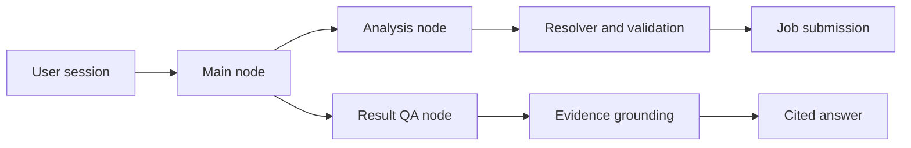

# OmicsPrism Platform

OmicsPrism Platform is a FastAPI + React workbench for omics analyses.
It supports PostgreSQL, Redis, a worker process, and an object storage layer.

## Repository layout

```text
omicsprism-platform/
  backend/     FastAPI API, worker, storage, quota, audit, scripts
  frontend/    React + TypeScript + Vite UI
  docs/        deployment notes
  docker-compose.yml
  .env.example
```

For a Chinese handoff and integration reference, see
[`docs/OMICS_PRISM_INTEGRATION_GUIDE_ZH.md`](docs/OMICS_PRISM_INTEGRATION_GUIDE_ZH.md).

For a field-level description of DEG, DEM, and GMA result tables, see
[`docs/OMICS_PRISM_RESULT_TABLES_ZH.md`](docs/OMICS_PRISM_RESULT_TABLES_ZH.md).

## OmicsPrism Copilot architecture

The copilot runs as a single LangGraph inside the existing backend. The model
chooses a typed semantic action; deterministic Python services retain ownership,
validation, job submission, artifact access, and evidence binding.



The Analysis node can inspect datasets, resolve and validate requests, and
create analysis Jobs after confirmation. The Result QA node is read-only and
must ground data claims in ownership-bound artifact evidence.

## Prerequisites

- Python 3.10+
- Node.js 18+ or 20+
- Docker and Docker Compose, if you want the containerized stack
- The sibling OmicsPrism analysis repository at `../omicsprism`

## Local development

### 1. Create the environment

```powershell
copy .env.example .env
python -m venv .venv
.\.venv\Scripts\activate
python -m pip install -r requirements.txt
npm install --prefix frontend
```

The root requirements file installs both the platform dependencies and the
sibling `../omicsprism` analysis package. On Linux, the lowercase directory
name is significant. Verify the analysis package before starting API or worker:

```powershell
python -c "import omicsprism; print(omicsprism.__file__)"
```

If you use the local fallback file storage and in-process worker, set these in
`.env`:

```powershell
OMICS_PRISM_STORAGE_BACKEND=json
OMICS_PRISM_EXECUTOR=local
OMICS_PRISM_FILE_STORAGE_BACKEND=local
```

### 2. Start the backend

```powershell
python -m uvicorn backend.app.main:app --reload --port 8000
```

### 3. Start the frontend

```powershell
npm run dev --prefix frontend
```

Frontend URL:

```text
http://localhost:5173
```

Vite proxies `/api` to `http://127.0.0.1:8000` in development.

### 4. Start the worker

If you are using Redis-backed execution:

```powershell
python -m backend.worker
```

### 5. Health check

```powershell
curl http://localhost:8000/health
```

## Docker Compose backend stack

The included `docker-compose.yml` starts:

- `postgres`
- `redis`
- `minio`
- `api`
- `worker`
- `housekeeping`

The frontend is built as static files and served by the host nginx or server
panel site directory. It is not started as a compose service by default.

### Start the backend stack

```powershell
copy .env.example .env
docker compose up --build
```

URLs:

- API: `http://127.0.0.1:18086`
- Health check: `http://127.0.0.1:18086/health`

### Stop the stack

```powershell
docker compose down
```

To remove volumes as well:

```powershell
docker compose down -v
```

Gate E deployment, rollback, cross-user 404, and model-off verification steps
are recorded in [`PHASE_6E_REPORT.md`](PHASE_6E_REPORT.md) and
[`docs/OMICS_PRISM_SERVER_UPDATE_ZH.md`](docs/OMICS_PRISM_SERVER_UPDATE_ZH.md).

## Database migration

The API can use local JSON storage or PostgreSQL. For PostgreSQL, schema
migrations use an administrator DSN while API and worker use the separate
`omics_app` runtime role.

### Migrate local JSON data into PostgreSQL

1. Start PostgreSQL.
2. Set environment variables:

```powershell
$env:OMICS_PRISM_STORAGE_BACKEND = "postgres"
$env:OMICS_PRISM_RUNTIME_DATABASE_URL = "postgresql://omics_app:<runtime-password>@localhost:5432/omicsprism"
```

3. Apply platform schema migrations first, with an administrator role:

```powershell
$env:OMICS_PRISM_MIGRATION_DATABASE_URL = "postgresql://migration_admin:<admin-password>@localhost:5432/omicsprism"
$env:OMICS_PRISM_APP_DB_PASSWORD = "<runtime-password>"
python scripts/migrate.py
```

In the compose stack, run this once before starting API and worker:

```powershell
docker compose --profile migration run --rm migrate
```

4. Run the JSON data migration, if required:

```powershell
python -m backend.scripts.migrate_json_to_postgres
```

The migration script copies users, projects, jobs, and audit data into the
PostgreSQL schema.

## Object storage initialization

### Local MinIO setup

When using the compose stack, MinIO is started automatically and the bucket is
created by `minio-init`.

If you want to prepare MinIO manually:

```powershell
mc alias set local http://localhost:9000 minioadmin minioadmin
mc mb -p local/omicsprism
```

Keep the bucket private. API downloads should go through authenticated backend routes. Do not enable anonymous bucket access for production data unless you have a very specific public-data use case.

### Production S3/MinIO variables

Set these for object storage:

```powershell
OMICS_PRISM_FILE_STORAGE_BACKEND=s3
OMICS_PRISM_S3_ENDPOINT_URL=http://localhost:9000
OMICS_PRISM_S3_REGION=us-east-1
OMICS_PRISM_S3_ACCESS_KEY_ID=minioadmin
OMICS_PRISM_S3_SECRET_ACCESS_KEY=minioadmin
OMICS_PRISM_FILE_STORAGE_BUCKET=omicsprism
OMICS_PRISM_FILE_STORAGE_PREFIX=jobs
# Optional. Leave unset to keep downloads authenticated through the API.
OMICS_PRISM_FILE_STORAGE_PUBLIC_BASE_URL=
```

## Production deployment

Use PostgreSQL, Redis, the worker, and object storage together.

### Recommended services

- API: `python -m uvicorn backend.app.main:app --host 0.0.0.0 --port 8000`
- Worker: `python -m backend.worker`
- Frontend: build and serve `frontend/dist` from the host nginx site directory
- PostgreSQL: persistent database
- Redis: queue backend
- S3/MinIO: result and input artifact storage

### Minimal production checklist

1. Copy `.env.example` to `.env`.
2. Set `OMICS_PRISM_STORAGE_BACKEND=postgres`.
3. Set `OMICS_PRISM_EXECUTOR=redis`.
4. Set `OMICS_PRISM_FILE_STORAGE_BACKEND=s3`.
5. Initialize the database schema.
6. Initialize the object storage bucket.
7. Start API, worker, and housekeeping.
8. Run housekeeping from cron or a scheduler:

```powershell
python -m backend.scripts.storage_housekeeping
```

### Static frontend plus Docker backend

On the server, keep the source repositories next to each other:

```bash
/www/omicsprism-deploy/omicsprism
/www/omicsprism-deploy/omicsprism-platform
```

Start or update the backend containers:

```bash
cd /www/omicsprism-deploy/omicsprism-platform
cp .env.example .env  # first deployment only
docker compose -p omicsprism up -d --build
docker compose -p omicsprism ps
curl -i http://127.0.0.1:18086/health
```

If the reverse proxy connects from another host instead of the same server, set
`API_BIND_HOST=0.0.0.0` in `.env` before recreating the containers. Keep
`API_BIND_HOST=127.0.0.1` when nginx runs on the same server.

Build the frontend static files:

```bash
cd /www/omicsprism-deploy/omicsprism-platform
npm install --prefix frontend
VITE_PUBLIC_BASE_PATH=/omicsprism/ VITE_API_BASE_PATH=/omicsprism/api npm run build --prefix frontend
```

Copy `frontend/dist` to the site directory managed by the host nginx panel.
For example:

```bash
rm -rf /www/nginx/nginx_html/html/omicsprism/*
cp -a frontend/dist/. /www/nginx/nginx_html/html/omicsprism/
```

The host nginx site should serve that directory under `/omicsprism/` and proxy API
requests to the backend container port:

```nginx
location ^~ /omicsprism/api/ {
    rewrite ^/omicsprism/api/(.*)$ /api/$1 break;
    proxy_pass http://127.0.0.1:18086;
    proxy_set_header Host $host;
    proxy_set_header X-Real-IP $remote_addr;
    proxy_set_header X-Forwarded-For $proxy_add_x_forwarded_for;
    proxy_set_header X-Forwarded-Proto $scheme;
    client_max_body_size 500M;
    proxy_read_timeout 3600s;
    proxy_send_timeout 3600s;
    proxy_buffering off;
}

location = /omicsprism/health {
    rewrite ^/omicsprism/health$ /health break;
    proxy_pass http://127.0.0.1:18086;
}

location = /omicsprism {
    return 301 /omicsprism/;
}

location ^~ /omicsprism/ {
    alias /www/nginx/nginx_html/html/omicsprism/;
    try_files $uri $uri/ /omicsprism/index.html;
}

# Do not cache the SPA entrypoint; it references hashed assets from each build.
location = /omicsprism/index.html {
    alias /www/nginx/nginx_html/html/omicsprism/index.html;
    add_header Cache-Control "no-cache, no-store, must-revalidate" always;
    expires -1;
}
```

The frontend uses browser routes rather than in-memory page state. Keep the
`try_files` fallback above so that direct visits and refreshes work for all
application paths:

```text
/omicsprism/                     Landing page
/omicsprism/home                 Analysis module home
/omicsprism/new                  Analysis module home
/omicsprism/deg                  DEG form
/omicsprism/dem                  DEM form
/omicsprism/gma                  GMA form
/omicsprism/jobs/:jobId          Job progress
/omicsprism/jobs/:jobId/results  Results
/omicsprism/copilot              Copilot conversation workspace
/omicsprism/download             Example downloads
/omicsprism/help/tutorial        Tutorial
/omicsprism/help/contact         Contact
```

## Environment variables

The full list is in `.env.example`. Important groups:

- Database: `OMICS_PRISM_STORAGE_BACKEND`, `OMICS_PRISM_RUNTIME_DATABASE_URL`
- Queue: `OMICS_PRISM_EXECUTOR`, `OMICS_PRISM_REDIS_URL`, `OMICS_PRISM_REDIS_QUEUE`
- Object storage: `OMICS_PRISM_FILE_STORAGE_BACKEND`, `OMICS_PRISM_S3_ENDPOINT_URL`, `OMICS_PRISM_FILE_STORAGE_BUCKET`, `OMICS_PRISM_FILE_STORAGE_PREFIX`
- Quotas: `OMICS_PRISM_MAX_CONCURRENT_JOBS_PER_USER`, `OMICS_PRISM_MAX_CONCURRENT_JOBS_PER_PROJECT`, `OMICS_PRISM_FILE_STORAGE_QUOTA_BYTES`
- Auth: `OMICS_PRISM_DEV_EMAIL`, `OMICS_PRISM_DEV_PASSWORD`

## Common troubleshooting

### Database connection fails

Check that PostgreSQL is reachable and the URL is correct:

```powershell
python -c "import os; print(os.getenv('OMICS_PRISM_RUNTIME_DATABASE_URL'))"
```

Typical fixes:

- verify host, port, user, password, and database name
- confirm the `postgres` container is healthy in `docker compose ps`
- ensure `OMICS_PRISM_STORAGE_BACKEND=postgres` only when PostgreSQL is ready

### Redis connection fails

Check the Redis URL and queue backend:

```powershell
python -c "import os; print(os.getenv('OMICS_PRISM_REDIS_URL'))"
```

Typical fixes:

- confirm `OMICS_PRISM_EXECUTOR=redis`
- confirm Redis is running and healthy
- restart the worker after changing Redis settings

### Worker does not consume jobs

Check:

```powershell
docker compose logs -f worker
```

or, if running locally:

```powershell
python -m backend.worker
```

Typical causes:

- worker is not started
- Redis URL is wrong
- API and worker are pointing to different Redis queues
- jobs are blocked by quota checks

### File download fails

Typical causes:

- object storage bucket not created
- `OMICS_PRISM_FILE_STORAGE_PUBLIC_BASE_URL` is wrong
- MinIO/S3 credentials are wrong
- artifact metadata exists but the object key was deleted

Check the object store and the job file metadata. If the job is local-only,
verify that `OMICS_PRISM_FILE_STORAGE_BACKEND=local` and the `storage/` or
`runs/` directory exists.

### Job fails

Check the job progress page and the worker logs first:

```powershell
docker compose logs -f worker
```

or:

```powershell
curl http://localhost:8000/api/jobs/<job_id>/logs
```

The frontend shows a `request_id` on error panels. Use that id when checking
API logs and audit events.

## Useful scripts

```powershell
python -m backend.scripts.migrate_json_to_postgres
python -m backend.scripts.storage_housekeeping
python -m uvicorn backend.app.main:app --reload --port 8000
python -m backend.worker
```

## Notes

- Deterministic result summaries are available at `/api/jobs/{job_id}/summary`.
- Cancellation, rerun, and quota APIs are available in the workbench.
- Audit events and structured logs are emitted by API and worker.
